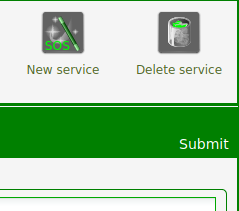
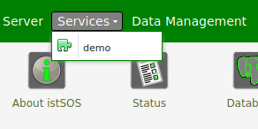

Table of Contents
=================

   * [Workshop general guidelines](#workshop-general-guidelines)
   * [Sensor Observation Service](#sensor-observation-service)
      * [Sensor Web Enablement](#sensor-web-enablement)
      * [Sensor Observation Service](#sensor-observation-service-1)
   * [istSOS : An open-source OGC SOS Implementation](#istsos--an-open-source-ogc-sos-implementation)
      * [Technology stack](#technology-stack)
      * [istSOS deployment with Docker](#istsos-deployment-with-docker)
      * [Docker installation](#docker-installation)
         * [Check installation status](#check-installation-status)
         * [Docker installation](#docker-installation-1)
         * [Docker-compose installation](#docker-compose-installation)
      * [Deploy istSOS](#deploy-istsos)
         * [Install git if necessary](#install-git-if-necessary)
         * [Clone and deploy](#clone-and-deploy)
         * [Shutting down the service](#shutting-down-the-service)
         * [Access the web user interface of istSOS](#access-the-web-user-interface-of-istsos)
      * [Configure your istSOS instance](#configure-your-istsos-instance)
      * [Create a new service](#create-a-new-service)
      * [Register a new sensor](#register-a-new-sensor)
      * [Register procedures automatically](#register-procedures-automatically)
      * [Observation offerings](#observation-offerings)
      * [Inserting observation data](#inserting-observation-data)
      * [Accessing data](#accessing-data)
         * [GetObservation request](#getobservation-request)
         * [GetObservation via WA API](#getobservation-via-wa-api)
      * [Viewing data](#viewing-data)
   * [Mapping sensor with OpenLayers 3](#mapping-sensor-with-openlayers-3)
      * [Loading istSOS sensor into the map](#loading-istsos-sensor-into-the-map)
      * [Change the istSOS vector layer style](#change-the-istsos-vector-layer-style)
      * [Display sensor metadata](#display-sensor-metadata)
   * [Web processing service](#web-processing-service)
      * [Process](#process)
      * [Data inputs and outputs](#data-inputs-and-outputs)
      * [Literal Data](#literal-data)
      * [Complex data](#complex-data)
      * [BoundingBox data](#boundingbox-data)
      * [Synchronous versus asynchronous process request](#synchronous-versus-asynchronous-process-request)
         * [Synchronous mode](#synchronous-mode)
         * [Asynchronous mode](#asynchronous-mode)
      * [PyWPS : OpenSource python WPS implementation](#pywps-opensource-python-wps-implementation)
      * [First steps](#first-steps)
         * [GetCapabilities](#getcapabilities)
         * [Ask the ultimate question](#ask-the-ultimate-question)
         * [Create a new process](#create-a-new-process)
   * [SOS/WPS : A real world example](#soswps--a-real-world-example)
      * [No, this workshop was not a complete waste of your time ;)](#no-this-workshop-was-not-a-complete-waste-of-your-time-)

# Workshop general guidelines

:keyboard: => This means an answer is expected from you. You can write your answers in a new markdown document or any other type of document you will send at the end of the workshop.

:computer_mouse: => This denotes an action you must do to progress into the workshop

# Sensor Observation Service

[Sensor Observation Service (SOS)](https://www.ogc.org/standards/sos) is an Open Geospatial Consortium ([OGC](https://www.ogc.org/)) approved standard (in version 1 and 2) that is part of the Sensor Web Enablement ([SWE](https://www.ogc.org/node/698)) initiative.

## Sensor Web Enablement

The OGC Sensor Web Enablement (SWE) working group was established to provide a first definition of the system that is able to enable the development of the Sensor Web idea by identifying the technology, the language syntax and the architecture to be used.

In summary, the SWE aim is to define a unique environment where specialists and users can search, access, and process data observed by a multitude of heterogeneous sensor networks.

With this propose the SWE working group has defined a series of OpenGIS® standards:

1. [SWE Common](https://www.ogc.org/standards/swecommon): XML model for sensors data
2. [SensorML](https://www.ogc.org/standards/sensorml) (Sensor model Language): XML model for processes and components
3. [O&M](https://www.ogc.org/standards/om) (Observation and Measurements): XML model for the observation and measurements
4. [SOS](https://www.ogc.org/standards/sos) (Sensor Observation Service): interface for data access and distribution
5. [SPS](https://www.ogc.org/standards/sps) (Sensor Planning Service): interface for the sensor operation activation

And a series of candidate specification or discussion paper like the:

1. SAS (Sensor Alert Service): interface for dispatching alerts using the XMPP (extensible messaging and presence protocol)
2. WMS (Web Notification Service): interface for the notification of information with different protocols

## Sensor Observation Service

As part of the SWE, the Sensor Observation Service standard defines the interface to interact with sensor observations: from sensors exploration to measures retrieval and data management throughout transactional operations. It worth noting that this description refers to SOS in version 1; the version 2 of the standard introduces some minor changes.

Like most of the OGC standards, the SOS service is based on the exchange of standard messages (requests and responses) between the service and the consumer by using the HTTP protocol. 

The requests are sent to the service through an HTTP POST (in this case an XML file formatted according to the specification is submitted) or an HTTP GET method (in this case a KVP, key-value-pairs, is submitted) specifying the request type and the relative permitted parameters. 

The service responses are always XML file compliant with the specifications. According to the OGC specification a SOS version 1.0 service must implement at minimum the three mandatory requests of the SOS core profile, while the operations or other profiles are optional

:keyboard: **Download the OGC SOS standard in its 1.0.0 version from the OGC website : list all the mandatory operations of the service and describe briefly what the goal of each operation is.** (1 point)

:keyboard: **What are the different profiles available for the SOS service in its 1.0.0 version ?** (1 point)

The typical use cases from a data consumer and data producer perspective are presented in the following UML sequence diagrams:

<p align="center">
 
   <br/>
 <em>UML sequence diagrams for some of the OGC SOS 1.0.0 operations</em>
</p>

The SOS is based on five key objects as represented in Figure-2 :

1. **Observations**: they are the center of the standard and represent the **values mesured** at given time instants (e.g.: value: 0.2, time: 08-11-2012 12:12) and represented according to the O&M standard data model.
2. **Procedure**: indicates who provide the observations, this is generally the **sensor** but it may also be a generic process that leads to some observations (e.g.: procedure: TREVANO) and is represented as SensorML standard data model.
3. **Observed Properties**: they represent the **phenomena** that are observed (e.g.: phenomenon: air-temperature) and is represented with a URI (uniform resource identifier) composed by colon separated text according to the om:observedProperty of the O&M standard.
4. **Feature of interest**: it is the feature that relates to the observations, so for an in-place instrument is the **sensor location**, while for remote device it the target location (e.g.: location: Trevano, coordinates: 718345,99224,389, reference system: CH1903/LV03) represented according to the om:featureOfInterest element of the O&M standard.
5. **Offering**: it is a **collection of sensor** used to conveniently group them up (e.g.: offering: weather-sensor-SUPSI) and is represented as sos:ObservationOffering element of the SOS standard.

<p align="center">
 
  <br/>
 <em>OGC SOS main datatypes</em>
</p>

:keyboard: **Explain in your own words what problem(s) the OGC SOS 1.0.0 standard is trying to solve** (1 point)

# istSOS : An open-source OGC SOS Implementation

For this workshop we are going to use [istSOS](http://istsos.org/) developed by Istituto Scienze della Terra. 
The development of istSOS started in 2009 in order to provide a simple implementation of the SOS standard for the management, provision and integration of hydro-meteorological data.
istSOS implement the full SOS standard (all the profiles) and proposes extensions to the standard in order the maximize the compatibility of the service and to offer a better user experience.

## Technology stack

IstSOS is a Python Free Open Source Software based on: 
* PostgreSQL / Postgis
* Apache / mod_wsgi
* Following python modules
	* isodate
    * psycopg2
    * pytz

<p align="center">
 
 <br/>
 <em>istSOS architecture</em>
</p>

## istSOS deployment with Docker

In order to ease the deployment of istSOS, we are going to use a Docker image. The source of the image is available at https://github.com/esgn/istsos-docker

## Docker installation

Have a look to this [page](https://www.freecodecamp.org/news/docker-simplified-96639a35ff36/) if you want to learn more about Docker.

### Check installation status

Check if docker and docker-compose is already installed on your machine by running the following commands:

```
$ docker --version
$ docker-compose --version
```
If a version number is returned in each case, docker and docker-compose are correctly installed. You can skip the docker and docker-compose installation paragraphs below. 
If it is not the case, install docker and docker-compose following the procedure below

### Docker installation

1. Update and install necessary packages

```
$ sudo apt-get update
```

> Troubleshooting : If some errors appears during the update of the package lists from the package sources **outside of ENSG network**, you might have some unreachable package sources in your `/etc/apt/sources.list` . If you are using Ubuntu 18.04 you can use this [file](etc/ubuntu-18.04/sources.list)
> ```
> $ cd ~
> $ sudo rm /etc/apt/sources.list
> $ wget https://raw.githubusercontent.com/esgn/pdm-workshop/main/etc/ubuntu-18.04/sources.list
> $ sudo cp sources.list /etc/apt/
> $ sudo apt-get update
> ```

> Troubleshooting : If some errors appears during the update of the package lists from the package sources **on the ENSG network** you might need to set proxy. To set ENSG proxy for the current terminal (this settings will dissapear if you close the terminal window)
> ```
> $ export HTTP_PROXY=http://10.x.x.x:3128
> $ export HTTPS_PROXY=http://10.x.x.x:3128
> $ export NO_PROXY=localhost,127.0.0.1
> ```

Then install the necessary packages

```
$ sudo apt-get install \
    apt-transport-https \
    ca-certificates \
    curl \
    gnupg-agent \
    software-properties-common -y
```
2. Add Docker's official GPG key
```
$ curl -fsSL https://download.docker.com/linux/ubuntu/gpg | sudo apt-key add -
```
3. Add docker repository
```
$ sudo add-apt-repository \
   "deb [arch=amd64] https://download.docker.com/linux/ubuntu \
   $(lsb_release -cs) \
   stable"
```
4. Install Docker
```
 $ sudo apt-get update
 $ sudo apt-get install docker-ce docker-ce-cli containerd.io -y
```
5. Verify docker installation : 
```
 $ sudo docker run hello-world
```

If Docker is correctly installed you should get a message like this one :
```
Unable to find image 'hello-world:latest' locally
latest: Pulling from library/hello-world
0e03bdcc26d7: Pull complete 
Digest: sha256:31b9c7d48790f0d8c50ab433d9c3b7e17666d6993084c002c2ff1ca09b96391d
Status: Downloaded newer image for hello-world:latest

Hello from Docker!
This message shows that your installation appears to be working correctly.

To generate this message, Docker took the following steps:
 1. The Docker client contacted the Docker daemon.
 2. The Docker daemon pulled the "hello-world" image from the Docker Hub.
    (amd64)
 3. The Docker daemon created a new container from that image which runs the
    executable that produces the output you are currently reading.
 4. The Docker daemon streamed that output to the Docker client, which sent it
    to your terminal.

To try something more ambitious, you can run an Ubuntu container with:
 $ docker run -it ubuntu bash

Share images, automate workflows, and more with a free Docker ID:
 https://hub.docker.com/

For more examples and ideas, visit:
 https://docs.docker.com/get-started/
```

> Troubleshooting : If Docker is not able to get the image while working on the ENSG network it probably needs ENSG proxy definition.
> ```
> $ sudo mkdir -p /etc/systemd/system/docker.service.d
> $ sudo touch /etc/systemd/system/docker.service.d/http-proxy.conf
> $ sudo gedit /etc/systemd/system/docker.service.d/http-proxy.conf
> ```
> Add the following lines to the file and save
> ```
> [Service]
> Environment="http_proxy=http://10.x.x.x:3128/"
> Environment="https_proxy=https://10.x.x.x:3128/"
> Environment=no_proxy=localhost,127.0.0.1
> ```
> Then execute the following commands
> ```
> $ sudo systemctl daemon-reload
> $ sudo systemctl restart docker
> ```
> And try again 
> ```
> $ sudo docker run hello-world
> ```

6. Create the docker group if it does not exist already
```
$ sudo groupadd docker
```
7. Add your user to the docker group.
```
$ sudo usermod -aG docker $USER
```
8. Active the changes
```
$ newgrp docker 
```
9. Verify that you can run `docker` commands without `sudo`
```
$ docker run hello-world
```

### Docker-compose installation

1. Install curl if curl is not already installed
```
$ sudo apt install curl -y
```
2. Get docker-compose

```
$ sudo curl -L "https://github.com/docker/compose/releases/download/1.27.4/docker-compose-$(uname -s)-$(uname -m)" -o /usr/local/bin/docker-compose
```
3. Apply executable permissions to the binary
```
$ sudo chmod +x /usr/local/bin/docker-compose
```
4. Test the installation 
```
$ docker-compose --version
```
You should get a message like this one
```
docker-compose version 1.27.4, build 40524192
```

## Deploy istSOS

### Install git if necessary

It the following command does not return a version number
```
$ git --version
```
Install git with
```
$ sudo apt install git -y
```

### Clone and deploy

Now that we’ve installed Docker and Docker Compose, we’re now ready to build and automatically deploy an instance of ISTsos. 
**Warning**: The database content is not persisted. If you kill the docker containers you will lose all your changes.

First clone the repository

```
$ cd ~
$ git clone https://github.com/esgn/istsos-docker.git
```

> Troubleshooting : If you encounter some difficulties during the git clone operation from the ENSG network, git is probably missing the ENSG proxy information. Add the following information and try to clone again. **Ask for the full IP of the ENSG proxy**.
> ```
> $ git config --global http.proxy http://10.x.x.x:3128
> $ git config --global https.proxy http://10.x.x.x:3128
> ```

Then deploy the istSOS service using docker-compose. The service might take a few minute to deploy.
```
$ cd ~/istsos-docker
$ docker-compose up -d
```

> Troubleshooting : Once again, Docker will need to access the Internet to build the istSOS image. If you are working from the ENSG network, proxy information may be needed. Edit the `~/istsos-docker/docker-compose.yml` file.
> Uncomment the proxy args
> ```
>   istsos:
>     container_name: istsos-2.3.3
>     build :
>       context: ./istsos
>       # If docker runs behind proxy
>       # args:
>         # http_proxy: 'http://bloody_proxy_IP:3128'
>         # https_proxy: 'http://bloody_proxy_IP:3128'
>     ports:
>       - "127.0.0.1:80:80"
> ```
>  And define the proxies with the ENSG proxy IP
> ```
>   istsos:
>     container_name: istsos-2.3.3
>     build :
>       context: ./istsos
>       args:
>         http_proxy: 'http://10.x.x.x:3128'
>         https_proxy: 'http://10.x.x.x:3128'
>     ports:
>       - "127.0.0.1:80:80"
> ```

### Shutting down the service

If at any time you want to start again and erase all changes done to the istSOS service you can use the `docker-compose down` command. **Warning** the database containing your changes will be erased if you choose to do so. **Do not test this command now, save it for later use in case of errors**
```
$ cd ~/istsos-docker
$ docker-compose down -v
```

### Access the web user interface of istSOS

Once istSOS has started the user interface of the service might can be accessed in your browser at the following address : http://localhost/istsos/admin 

<p align="center">
 
 <br/>
 <em>istSOS web user interface</em>
</p>

## Configure your istSOS instance

With istSOS you can organize your sensor data in different instances. Every instance has its own database schema independent from other instances. You can even deploy other databases over your network according to your needs.

<p align="center">
 
 <br/>
 <em>istSOS instances example</em>
</p>

The first steps into istSOS setup is to configure the default configuration options. These options will then be automatically used for your convenience by every new istSOS instance created.

:computer_mouse: **Open the admin interface in a browser**
```
http://localhost/istsos/admin
```

:computer_mouse: **Configure the default database connection**


Click on the database icon and fill the form using the following values.

| Parameter | Value |
| --- | --- |
| User | pdm |
| Password | pdm |
| Host | istsos-db |
| Port | 5432 |
| DB name | istsos | 

These values are the one defined in the `docker-compose.yml` file. The istsos container is able to contact the istsos-db container directly using its name. 

* :computer_mouse:  Test the connection using the "Test connection" button. The test should be successful.

* :warning: Do not forget to click on the Submit button on the top right corner to save your changes before leaving
  
<p align="center">
 
</p>

:computer_mouse: **Configure the default Service provider information**


It is possible to configure the details of an institution there. 

Change the contact name with your name and Submit

:computer_mouse: **Configure the default Service identification information**


Is it possible to configure the custom metadata that describe the service usage.

Leave the existing information untouched.

:computer_mouse: **Configure your service coordinates system**


Default EPSG code:  This will be the native Coordinate Reference System of your geometries in the database. Leave it untouched

Permitted EPSG:  Here you can configure which other Coordinate Reference Systems your system will support and reproject to if requested.

:computer_mouse: **Configure your getObservation request options**


Set maximum time interval per GetObservation requests (zero for no limits) and aggregation no-data value. 

Leave it untouched

:computer_mouse: **Configure your service proxy address**


The Proxy URL field is the base URL seen beyond a reverse proxy. Leave it untouched

<br/>

:keyboard: **In your opinion, where service provider information, service identification information, service coordinates system and getObservation options will be made available to there end-user ? Through a SOS service operation ? If so, which operation ?** (1 point)

## Create a new service

Now that you have configured istSOS, it’s time to create a new service instance !

:computer_mouse: **Create a new service**


Click and press Next.

Set the new service name to **demo** for this workshop.

Here you could also change the default EPSG and database configuration for this istSOS instance if you prefer to not use the defaults ones. Leave the EPSG field empty for this workshop.

Press next to create the new **demo** service. If something's gone wrong during the creation you will see an alert at this point.

:computer_mouse: **Get service GetCapabilities**

:keyboard: **Adapt the following URL to request the GetCapabilities of your new service http://localhost/istsos/demo?request=xxxxxxx&service=xxxxxx and copy this URL in your document** (1 point)

Take some time to review the GetCapabilities document.

:keyboard: **Find in the GetCapabilities response the parameters of the GetCapabilities operation. What's the use of the "acceptversions" parameter ?** (1 point)

## Register a new sensor

Select your new demo service



Click on new procedure


In the **Procedure:** section

:computer_mouse: **Add new procedure**

| Parameter | Value |
| --- | --- |
|Name: |GRABOW|
|Description: |Enorasis Meteo Station in Grabow, Poland.|
|Keywords: |weather, meteorological,IUNG-PIB|
|System type: |insitu-fixed-point (autocomplete or select in list)|
|Sensor type: |Meteo Station|
FOI name: |GRABOW|
|EPSG: |4326 (autocomplete or select in list)|
|Coordinates: |x: 22.67 y: 51.25 z: 177|

:computer_mouse: **Add relative humidity**

In Outputs subsection

| Parameter | Value |
| --- | --- |
|Observed property:|urn:ogc:def:parameter:x-istsos:1.0:meteo:air:humidity:relative (autocomplete or select in list)|
|Unit of measure: |% (autocomplete or select in list)|
|Description: | |
|Quality index check: |Between / from 0 to 100|

Click **Add** and go the next observed property. 

:computer_mouse: **Add air rainfall**

| Parameter | Value |
| --- | --- |
|Observed property:|urn:ogc:def:parameter:x-istsos:1.0:meteo:air:rainfall (autocomplete or select in list)|
|Unit of measure: |mm (autocomplete or select in list)|
|Description: | |
|Quality index check: |Between / from 0 to +500|

Click **Add** and go the next observed property. 

:computer_mouse: **Add air temperature**

| Parameter | Value |
| --- | --- |
|Observed property:|urn:ogc:def:parameter:x-istsos:1.0:meteo:air:temperature (autocomplete or select in list)|
|Unit of measure: |°C (autocomplete or select in list)|
|Description: |conversion from resistance to temperature|
|Quality index check: |Between / from -40 to +60|

Click **Add** and go the next observed property. 

:computer_mouse: **Add wind velocity**

| Parameter | Value |
| --- | --- |
|Observed property:|urn:ogc:def:parameter:x-istsos:1.0:meteo:air:wind:velocity (autocomplete or select in list)|
|Unit of measure: |m/s (autocomplete or select in list)|
|Description: | |
|Quality index check: |Between / from 0 to 200|

Click **Add** and go the next observed property. 

:computer_mouse: **Add solar radiation**

| Parameter | Value |
| --- | --- |
|Observed property:|urn:ogc:def:parameter:x-istsos:1.0:meteo:solar:radiation (autocomplete or select in list)|
|Unit of measure: |W/m2 (autocomplete or select in list)|
|Description: | |
|Quality index check: |from 0 to +500|

:computer_mouse: **Click Submit button in the top right corner to create your new procedure**

## Register procedures automatically

In order to speed up the **boring** process of inserting all the other procedures we have prepared a script. 

We are going to execute an import script inside the istsos-2.3.3 container.

```
    $ docker exec -ti istsos-2.3.3 /bin/sh
    / # cd /tmp/tutorial
    /tmp/tutorial # python fill/execute.py
```
If everything goes according to plan you should see the following output after having executed execute.py
```
 Add procedure
 Add virtual procedure
 Add virtual procedure script
{"message": "", "success": true}
 Terminated :)
 ```
 
 You can now exit from the container
```
     /tmp/tutorial # exit
```

:keyboard: **Have a look at the [execute.py](https://github.com/esgn/istsos-docker/blob/master/istsos/files/tutorial/fill/execute.py) and [procedure.py](https://github.com/esgn/istsos-docker/blob/master/istsos/files/tutorial/fill/procedure.py) scripts. The request to create new procedures are sent to http://localhost/istsos/wa/istsos/services. What is the usual name of this kind of API where information is structured in the URL (e.g http://localhost/istsos/wa/istsos/services/demo/procedures/LOCARNO) and where messsage are exchanged as JSON objects ? What kind of HTTP request has been sent to http://localhost/istsos/wa/istsos/service to create the procedures ?** (1 point)

:computer_mouse: **Verify the inserted prodedures using the administration interface**


Click on procedures and verify you have more sensors than before.

:computer_mouse: **Verify the inserted prodedures using direct queries**

Let’s try to execute a getCapabilities request to verify if procedures are now available. We can use the "Requests" test page where some request examples are already available. Feel free to come back to this page to understand the various SOS operations and answer subsequents questions : 

	http://localhost/istsos/modules/requests

Full GetCapabilities request: 
	
	http://localhost/istsos/demo?request=getCapabilities&service=SOS

Full GetCapabilities request contents section only:
	
	http://localhost/istsos/demo?request=getCapabilities&section=contents&service=SOS 

:keyboard: **Now create an HTTP query to get more information about the T_LUGANO sensor using the Describe Sensor operation of the SOS standard. You will have to supply the outputFormat in its URL encoded form (`outputFormat=text%2Fxml%3Bsubtype%3D%22sensorML%2F1.0.1%22`). Copy this query in your document.** (1 point)

You can try for other procedure (aka sensor) like P_LUGANO, LOCARNO, BELLINZONA, GRABOW, RH_GNOSCA

:keyboard: **In what format are the information describing a procedure (aka sensor) returned ? What is the OGC standard used for describing the sensor ?** (1 point)

>Note : Procedures are stored in the SOS with a uniqueID which is urn:ogc:def:procedure:xistsos:1.0:XXXX for procedure named XXXX. 
>istSOS, as we will see later for other parameters, is not strict and allows to specify just the procedure name in the request. In the previous example we're using procedure=T_LUGANO instead of prodecure=urn:ogc:def:procedure:xistsos:1.0:LUGANO.

## Observation offerings

In the Sensor Observation Service 1.0.0 the concept of an Observation Offering is equivalent to that of a sensor constellation. An Observation Offering is analogous to a "layer" in Web Map Service because each offering is typically a non-overlapping group of related observations.

<p align="center">
  
   <br/>
   <em>Offerings example</em>
</p>


:computer_mouse: In Offerings click the **New** button? Enter the following information

| Parameter | Value |
| --- | --- |
|Name |	workshop|
|Description |	demo dataset|
|Expiration (optional) |	2022-01-01T00:00:00+09:00|
|Visibility 	|check Enabled|

:computer_mouse: **Associate procedures with offering**

Activate the tab panel pressing “Offering-procedure memberships”. In the dropdown list select the newly created offering “workshop”. On the left side you will see all the procedure that will be assigned to that offering. On the right there are all the procedures not assigned to that offering. Use drag and drop functionality to move procedures from right to left.

:computer_mouse: **Verify that procedures are associated with offering as desired**

Then check the getCapabilities request to see what happened.

http://localhost/istsos/demo?request=getCapabilities&section=contents&service=SOS&acceptversions=1.0.0

:keyboard: **Copy paste in your document the section  of the GetCapabilities that describes the workshop offering** (0.5 point)

> The “temporary” offering is system wide offering that is used to associate every registered procedure. Every new procedure is automatically assigned to this offering.

## Inserting observation data

For this part of the tutorial you should use ASCII files with sensor data formatted according to text/csv;subtype=istSOS. This format is a CSV represented by a header as the first line containing the URI names of the observed properties, the following lines contains the data. In a real world use case the sensors will upload data regularly as they are acquired. Here we are going to import multiple days of sensor data.

Example: T_LUGANO_20141231234000000.dat

```
urn:ogc:def:parameter:x-istsos:1.0:time:iso8601,urn:ogc:def:parameter:x-istsos:1.0:meteo:air:temperature
2015-01-01T00:10:00.000000+0100,0.446000
2015-01-01T00:20:00.000000+0100,0.862000
2015-01-01T00:30:00.000000+0100,0.932000
2015-01-01T00:40:00.000000+0100,0.384000
```

:computer_mouse: **Have a look at the CSV files in the istsos/files/dataset directory of the cloned repository**

We're going to upload the data using an existing script inside istsos-2.3.3 container.

:computer_mouse: **Import observation data for you service offerings**

```
$ docker exec -ti istsos-2.3.3 /bin/sh
    / # cd /usr/local/istsos
    /usr/local/istsos # python scripts/csv2istsos.py -p BELLINZONA LOCARNO P_LUGANO T_LUGANO GRABOW RH_GNOSCA -u http://localhost/istsos -s demo -w /tmp/dataset
```

The import will start and you should see text block like below as output of the python command 
```
Offering: temporary
Procedure: BELLINZONA
BELLINZONA > Sensor Description successfully loaded
BELLINZONA > GetObservation requested successfully executed
Searching: /tmp/dataset/BELLINZONA_[0-9]*.dat
Before insert ST: BELLINZONA
Insert ST: BELLINZONA
 > Begin: 2015-05-03T16:30:00+02:00
   + End: 2015-06-03T12:50:00+00:00
 > Values: 4455
> Insert observation success: True
```

You can exit the container when all the imports have taken place

```
    /usr/local/istsos # exit
```

The data are being imported by sending information to istSOS internal API.
Even if we have used the csv2istsos script to facilitate the data loading, users may also use the OGC SOS insertObservation operation directly. 

For example, a valid request for loading a single observation to the service is:

```
<?xml version="1.0" encoding="UTF-8"?>
<sos:InsertObservation
    xmlns:gml="http://www.opengis.net/gml"
    xmlns:om="http://www.opengis.net/om/1.0"
    xmlns:sos="http://www.opengis.net/sos/1.0"
    xmlns:swe="http://www.opengis.net/swe"
    xmlns:xlink="http://www.w3.org/1999/xlink"
    xmlns:xsi="http://www.w3.org/2001/XMLSchema-instance"
    service="SOS"
    version="1.0.0">
    <sos:AssignedSensorId>f10b70b2561111e5a35e0800278295cb</sos:AssignedSensorId>
    <sos:ForceInsert>true</sos:ForceInsert>
    <om:Observation>
        <om:procedure xlink:href="urn:ogc:def:procedure:x-istsos:1.0:LOCARNO"/>
        <om:samplingTime>
            <gml:TimePeriod>
                <gml:beginPosition>2015-06-03T14:10:00+02</gml:beginPosition>
                <gml:endPosition>2015-06-03T14:50:00+02</gml:endPosition>
            </gml:TimePeriod>
        </om:samplingTime>
        <om:observedProperty>
            <swe:CompositePhenomenon dimension="5">
                <swe:component xlink:href="urn:ogc:def:parameter:x-istsos:1.0:time:iso8601"/>
                <swe:component xlink:href="urn:ogc:def:parameter:x-istsos:1.0:meteo:air:rainfall"/>
                <swe:component xlink:href="urn:ogc:def:parameter:x-istsos:1.0:meteo:air:rainfall:qualityIndex"/>
                <swe:component xlink:href="urn:ogc:def:parameter:x-istsos:1.0:meteo:air:temperature"/>
                <swe:component xlink:href="urn:ogc:def:parameter:x-istsos:1.0:meteo:air:temperature:qualityIndex"/>
            </swe:CompositePhenomenon>
        </om:observedProperty>
        <om:featureOfInterest xlink:href="urn:ogc:def:feature:x-istsos:1.0:Point:LOCARNO"/>
        <om:result>
            <swe:DataArray>
                <swe:elementCount>
                    <swe:value>5</swe:value>
                </swe:elementCount>
                <swe:elementType name="SimpleDataArray">
                    <swe:DataRecord definition="urn:ogc:def:dataType:x-istsos:1.0:timeSeries">
                        <swe:field name="Time">
                            <swe:Time definition="urn:ogc:def:parameter:x-istsos:1.0:time:iso8601"/>
                        </swe:field>
                        <swe:field name="air-rainfall">
                            <swe:Quantity definition="urn:ogc:def:parameter:x-istsos:1.0:meteo:air:rainfall">
                                <swe:uom code="mm"/>
                            </swe:Quantity>
                        </swe:field>
                        <swe:field name="air-rainfall:qualityIndex">
                            <swe:Quantity definition="urn:ogc:def:parameter:x-istsos:1.0:meteo:air:rainfall:qualityIndex">
                                <swe:uom code="-"/>
                            </swe:Quantity>
                        </swe:field>
                        <swe:field name="air-temperature">
                            <swe:Quantity definition="urn:ogc:def:parameter:x-istsos:1.0:meteo:air:temperature">
                                <swe:uom code="°C"/>
                            </swe:Quantity>
                        </swe:field>
                        <swe:field name="air-temperature:qualityIndex">
                            <swe:Quantity definition="urn:ogc:def:parameter:x-istsos:1.0:meteo:air:temperature:qualityIndex">
                                <swe:uom code="-"/>
                            </swe:Quantity>
                        </swe:field>
                    </swe:DataRecord>
                </swe:elementType>
                <swe:encoding>
                    <swe:TextBlock blockSeparator="@" decimalSeparator="." tokenSeparator=","/>
                </swe:encoding> <swe:values>2015-06-03T14:10:00+02,0,200,20.4,200@2015-06-03T14:20:00+02,0.1,200,19.5,200@2015-06-03T14:30:00+02,0.1,200,19.1,200@2015-06-03T14:40:00+02,0,200,19.5,200@2015-06-03T14:50:00+02,0,200,20.6,200</swe:values>
            </swe:DataArray>
        </om:result>
    </om:Observation>
</sos:InsertObservation>`
```

:computer_mouse: **Let’s insert observations using the XML format**

1. Open the requests test page: ​http://localhost/istsos/modules/requests/
2. Select the "demo" service instance
3. Choose the "POST" option
4. Select InsertObservation in the Requests dropdown menu
5. Press "Send"
6. Note: You may need to update the `<AssignedSensorId>` with the correct id of the sensor.

:keyboard: **What is the reponse of the service. What is the meaning of `<AssignedObservationId>` and its content ?** (1 point)

:keyboard: **How could such an operation be used in the real world ? Imagine a simple use case that will use the InsertObversation operation.** (1 point)

## Accessing data

Accessing the data is possible using the SOS Standard requests, WA REST requests or directly using the Data Viewer or Data Editor.

<p align="center">
  
   <br/>
   <em>Accessing data in istSOS</em>
</p>

### GetObservation request

| Parameter | Value |
| --- | --- |
|Parameter |Description |Definition |Multiplicity and Use|
|request |getObservation is designed to request detailed sensor metadata |getObservation |One (mandatory)|
|service |Service type identifier |SOS |One (mandatory)|
|version |Specification version for operation |1.0.0 |One (mandatory)|
|srsName |Defines the spatial reference system that should be used for any geometries that are returned in the response. |This must be one of the advertised values in the offering specified in |gml:srsName elements. |One (Optional)|
|offering |Specifies the offering URI advertised in the GetCapabilities document. All of the following parameters are dependent on the selected offering. |This must match the gml:name of the offering or be constructed as a URL with a fragment identifier resolving to the offering gml:id. |One (mandatory)|
|eventTime |Specifies the time period(s) for which observations are requested. This allows a client to request observations from a specific instant, multiple instances or periods of time in the past, present and future. The supported range is listed in the selected offering capabilities |ISO 8601 Examples: Time instant: 2015-06-11T17:30:00+0200 Time period 2015-06-11T14:30:00+0200/ 2015-06-11T17:30:00+0200 |Zero or many (Optional)|
|procedure |The procedure parameter specifies the sensor system(s) for which observations are requested. It defines a filter for the procedure property of the observations. |comma separated valid sensors from the GetCapabilities |Zero or many (Optional|
|observedProperty |  |  |One or many (mandatory)|
|featureOfInterest |Specifies the feature for which observations are requested. This can either be represented by a reference to a feature ID advertised in the capabilities document or can be a spatial constraint. |  |Zero or many (Optional)|
|responseFormat |Specifies the desired resultFormat MIME content type for transport of the results (e.g. TML, O&M native format, or MPEG stream out-of-band). The supported output formats are listed in the selected offering capabilities. Desired output format of the getObservation operation. This can be a MimeType or QName for example. |text/xml;subtype=”sensor ML/1.0.0” |One (mandatory)|

:keyboard: **Write an HTTP GET query using the OGC SOS 1.0.0 syntax that returns rainfalls from sensor LOCARNO between 2015-05-03T15:00:00+01 and 2015-05-04T14:59:59+01. Copy the query in your document** (2 points)

:keyboard: **Write the same query to get the result in JSON as output format. Copy the query in your document** (0.5 point)

### GetObservation via WA API

Composing a WA request is all about building the correct path URL. To get the observations execute this request: 

   http://localhost/istsos/wa/istsos/services/demo/operations/getobservation/offerings/temporary/procedures/T_LUGANO/observedproperties/temperature/eventtime/2015-05-21T00:00:00+02:00/2015-05-28T00:00:00+02:00

This API does not abide by any standard. The standard of this API is defined by istSOS only. It aims at being less verbose and mode practical to use.

## Viewing data

Open you Web Viewer and follow this link

   http://localhost/istsos/admin

In the "Data Management" section press the "Data Viewer" button. Go ahead and take some confidence with the data viewer. Try and visualize some of the data "acquired" by the procedures (aka sensor)

<p align="center">
  
     <br/>
   <em>Viewer displaying a plot of observations</em>
</p>

# Mapping sensor with OpenLayers 3

In this part you are going to create a basic web cartographic view of our sensors using OpenLayers3. (http://openlayers.org)

You'll find [here](quickstart.html) a first html page that display a map. 

:computer_mouse: **At this point you might want to clone this repository to your local disk in order to edit the HTML files more easily**

```
	$ cd ~
	$ git clone https://github.com/esgn/pdm-workshop.git
```

## Loading istSOS sensor into the map

Via its REST interface istSOS allow to get the list of all procedures in the GeoJSON format

http://localhost/istsos/wa/istsos/services/demo/procedures/operations/geojson

To add the istSOS layer is quite simple. You have to create a Vector Layer with a Vector Source. And the source have to be configured defining the format (as GeoJSON) and the url (from where to download the GeoJSON data). GeoJSON is an open standard format designed to representing simple geographical features along with their non-spatial attributes. It's based on the JSON format. The coordinate reference system for all GeoJSON coordinates is WGS84 (EPSG 4326) that is to say longitude, latitude in decimal degree.

:keyboard: **You'll find [here](quickstart2.html) a second html page you'll have to edit to display sensor on the map. You'll have to replace the XXX that appears in the file by the correct value. All the information needed are in the previous paragraph.**

## Change the istSOS vector layer style

Add the following lines to the previous example to modify the rendering style of the map.

```
		style: [new ol.style.Style({
			image: new ol.style.Circle({
					radius: 5,
					fill: new ol.style.Fill({color: 'green'}),
					stroke: new ol.style.Stroke({color: 'red', width: 1})
				})
			})]	
```

:keyboard: **Have a look at https://openlayers.org/workshop/en/vector/style.html to know where to put this block in quickstart2.html**

## Display sensor metadata

You'll find [here](quickstart3.html) a second html page you'll have to edit to display sensor on the map

:keyboard: **When the user click on a sensor position we want to display the start time and end time of measurement and the observed properties. You'll have to find the name of the start and end time of sampling and replace the XXX in the html file. Clue : All the data displayed in the webpage come from this request : http://localhost/istsos/wa/istsos/services/demo/procedures/operations/geojson**

```
			"Begin: " + feature.getProperties().samplingTime.XXX + "<br/>" +
			"End: " + feature.getProperties().samplingTime.XXX + "<br/><br/>" 
```

:keyboard: **You will join the 2 edited webpages to your document** (2 points = 0.5 + 0.5 + 1)

# Web processing service

OGC Web Processing Service standard provides rules for standardizing how inputs and outputs (requests and responses) for geospatial processing services. 
The standard also defines how a client can request the execution of a process, and how the output from the process is handled. 
It defines an interface that facilitates the publishing of geospatial processes and clients discovery of and binding to those processes. 
The data required by the WPS can be delivered across a network or they can be available at the server.
WPS is intended to be state-less protocol (like any OGC services). 
For every request-response action, the negotiation between the server and the client has to start. There is no official way, how to make the server “remember”, what was before, there is no communication history between the server and the client.

## Process

A process p is a function that for each input returns a corresponding output 

```
p:X→Y
```
where X denotes the domain of arguments x and Y denotes the co-domain of values y.

Within the specification, process arguments are referred to as process inputs and result values are referred to as process outputs. 
Processes that have no process inputs represent value generators that deliver constant or random process outputs.

Process is just some geospatial operation, which has it’s in- and outputs and which is deployed on the server. 
It can be something relatively simple (adding two raster maps together) or very complicated (climate change model). 
It can take short time (seconds) or long (days) to be calculated. Process is, what you might want to expose to other people and let their data be processed.

Every process has the following properties:
* Identifier : Unique process identifier
* Title : Human readable title 
* Abstract : Longer description of the process, what it does, how is it supposed to be used
* And a list of inputs and outputs.

## Data inputs and outputs

OGC WPS defines 3 types of data inputs and outputs: LiteralData, ComplexData and BoundingBoxData.
All data types do need to have following properties:

* Identifier: Unique input identifier
* Title: Human readable title
* Abstract: Longer description of data input or output, so that the user could get oriented.
* minOccurs: Minimal occurrence of the input (e.g. there can be more bands of raster file and they all can be passed as input using the same identifier)
* maxOccurs: Maximum number of times, the input or output is present
* Depending on the data type (Literal, Complex, BoundingBox), other attributes might occur too.

## Literal Data

Literal data is any text string, usually short. 
It’s used for passing single parameters like numbers or text parameters. WPS enables to the server, to define allowedValues - list or intervals of allowed values, as well as data type (integer, float, string). Additional attributes can be set, such as units or encoding

## Complex data

Complex data are usually raster or vector files, but basically any (usually file based) data, which are usually processed (or result of the process). The input can be specified more using mimeType, XML schema or encoding (such as base64 for raster data).

## BoundingBox data

BoundingBox data are specified in OGC OWS Common specification as two pairs of coordinate (for 2D and 3D space). They can either be encoded in WGS84 or EPSG code can be passed too. They are intended to be used as definition of the target region.

## Synchronous versus asynchronous process request

There are two modes of process instance execution: Synchronous and asynchronous.

### Synchronous mode

The client sends the Execute request to the server and waits with open server connection, till the process is calculated and final response is returned back. This is useful for fast calculations which do not take longer than a couple of seconds

### Asynchronous mode

Client sends the Execute request with explicit request for asynchronous mode. If supported by the process the server returns back ProcessAccepted response immediately with URL, where the client can regularly check for process execution status.

## PyWPS : OpenSource python WPS implementation

In the pyWPS directory of this repository, you'll find a Dockerfile to run a demo instance of pywps

``` 
$ cd ~/pdm-workshop/pywps
$ docker build -t pywps-demo .
$ docker run -d -p 5000:5000 pywps-demo
```
> Troubleshooting : If you encounter some errors while building the docker image from the ENSG network, uncomment the ENV line from the Dockerfile and update them with ENSG proxy IP.
> ``` 
> # ENV HTTP_PROXY http://bloody_proxy_ip:3128
> # ENV HTTPS_PROXY http://bloody_proxy_ip:3128
> ```
> ``` 
> ENV HTTP_PROXY http://10.x.x.x:3128
> ENV HTTPS_PROXY http://10.x.x.x:3128
> ```

You can display the user interface of pyWPS in your browser by opening http://localhost:5000.

## First steps

### GetCapabilities

Open the GetCapablities of the service

:keyboard: **What are the mandatory operations of a WPS 1.0.0 ? By looking at the WPS standard explain what these operations do** (1 point)

### Ask the ultimate question

:keyboard: **Query the process "ultimate question" and record the answer of the process in your document** (1 point)

### Create a new process

:keyboard: **(Optional) Create a new process which takes data of a SOS sensor as input and returns, for example, the mean of the values. Have a look at http://pywps.readthedocs.io/en/master for more information on how to write custom WPS processes.** (5 points)

# SOS/WPS : A real world example

## No, this workshop was not a complete waste of your time ;)

We’ve discovered during the course of this workshop two new kings of OGC services. Unlike WMS, WMTS or WFS these services are rarely encountered by the general GIS users. 

You will find in the following presentation a real world application of SOS and WPS with the addition of RDF and GeoSparql : http://geospatialworldforum.org/2014/presentation/Sensors/Isao%20Kujima%20-%20geospatialworldforum2014X-PDF.pdf. This shows how interopable services can help different counterparts building rapidly data pipelines to gather information and offer a large variety of outputs (maps, statistics,...)

:keyboard: **Imagine a use case where sensor data and WPS could be used in your field of expertise (petroleum data management)** (2 points)
